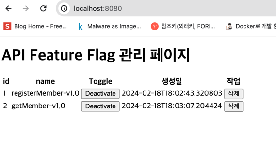

# 프로젝트 설명 
Feature Flag API를 구현하는 예제이며 Member를 등록하는 서비스 API와 해당 API들을 관리하는 Feature Flag API를 구성한다.

# 요구사항
1. 서비스를 제공하기위한 API들과 해당 API들을 관리할 수 있는 Feature Flag API를 구성한다. 
2. Feature Flag API는 다음과 같은 기능을 제공한다.
    - Feature Flag를 등록할 수 있다.
    - Feature Flag를 조회할 수 있다.
    - Feature Flag를 수정할 수 있다.
    - Feature Flag를 삭제할 수 있다.

# 추가적인 요소 
1. 현재, 사내에서 헥사고날 스터디를 함께 진행하고 있기에 해당 프로젝트에도 헥사고날 아키텍처를 적용해본다.

# 기술 스택
- Kotlin
- Spring Boot
- JPA
- H2
- Thymeleaf

# 도메인 구성 
- Member
  - id 
  - name
  - created_at

- FeatureFlag
  - id
  - name 
  - active
  - created_at

# 구현 페이지 

Active가 true일 경우 현재 사용가능한 API를 나타낸다.

Active가 false일 경우 현재 사용불가능한 API 나타낸다. 
